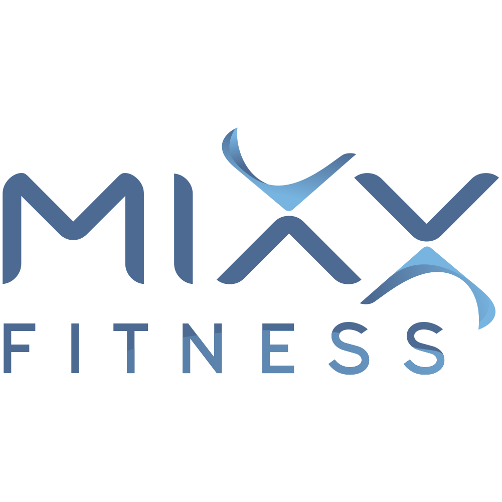

# MIXX Fitness — Website

A plain HTML/CSS/JS site. No build tools, no frameworks — open any `.html` file
directly in a browser, or use a "Live Server" extension in VS Code for auto-reload.

## Current status (read this first)

- **Homepage (`index.html`)** has real, finished content matching the client's
  latest content doc.
- **All other pages** (`services.html`, `teacher-training.html`, `pricing.html`,
  `about.html`, `contact.html`, `schedule.html`) are intentionally **empty
  shells** — header, page title, breadcrumb, and footer are in place and
  working, but the body content is a single "Ready to Paste" placeholder.
  This is deliberate, not a bug — content for these pages is being finalized
  separately and will be pasted in next.
- **Careers page has been removed** entirely, including all nav/footer links
  to it.
- **Fonts**: the site now uses **Plus Jakarta Sans** (bold modern sans-serif,
  used for all headings and body text) paired with **Pacifico** (a cursive
  accent font, used only for special accent moments like the "MIXX" word in
  the homepage hero, and the section quote under the marquee strip).

## How to edit this in VS Code

1. Open this whole folder in VS Code (`File > Open Folder`).
2. Install the **"Live Server"** extension (by Ritwick Dey) for auto-refreshing
   preview — right-click `index.html` → "Open with Live Server".
3. Edit any `.html` file directly. Each page is a normal, separate file —
   there is no templating system, so shared sections (header/footer) are
   repeated in every file. If you change the navigation or footer, update it
   in **all** HTML files, or convert to a templating/static-site setup later
   (e.g. 11ty, Astro) if that becomes painful.

## File structure

```
mixx-site/
├── index.html               → Homepage (content finished)
├── services.html             → Empty shell, ready for content
├── teacher-training.html     → Empty shell, ready for content
├── pricing.html               → Empty shell, ready for content
├── about.html                 → Empty shell, ready for content
├── contact.html               → Empty shell, ready for content
├── schedule.html               → Empty shell, ready for content
├── assets/
│   ├── css/
│   │   └── styles.css        → ALL styling for the entire site lives here
│   ├── js/
│   │   └── script.js         → Header scroll state, mobile menu, animations
│   └── images/
│       └── logo.png           → MIXX Fitness logo (used in header + footer)
└── README.md                   → This file
```

## Adding content to an empty-shell page

Each empty page has a clearly marked block like this in its HTML:

```html
<!-- =====================================================================
     EMPTY CONTENT ZONE — READY TO PASTE
     ===================================================================== -->
<section class="section-pad" style="padding-top:0;">
  <div class="wrap reveal">
    <div class="img-placeholder" style="min-height:240px;">
      ...
      <span class="ph-label">PAGE CONTENT — Ready to Paste</span>
    </div>
  </div>
</section>
```

To add real content: delete that whole `<section>` block and paste in your
own sections. Look at `index.html` for examples of real, working section
patterns already styled and ready to reuse (text blocks, two-column layouts,
card grids, etc.) — copy the HTML structure from there and swap in new text.

## The cursive font — where it's used and how to use it more

`var(--font-cursive)` resolves to `'Pacifico', cursive`. It's used sparingly,
only for accent moments, not for body text or most headings (cursive fonts
are hard to read in long blocks). Current usages:
- The word "MIXX" inside the homepage hero `<h1>`
- The floating "Small groups, big results" tag on the hero image
- The "MIXX your fitness, and MAXXimize your results" quote under the marquee
- The large number badges (01/02/03) on method-style image blocks
- The pricing page's "Most Popular" ribbon area (if reused)

To use it elsewhere, just add `font-family: var(--font-cursive);` to any
element's style.

## Editing the logo

The logo file is at `assets/images/logo.png`. It's referenced in the header
and footer of **every page** with:

```html

```

To swap it, just replace `assets/images/logo.png` with your new file (keep
the same filename, or update the `src` path everywhere it's used).

## Image placeholders

Every spot in the site that should eventually hold a real photo currently
shows a dashed placeholder box labeled with:
- What the image is for (e.g. "HERO IMAGE — Studio / Class Photo")
- The recommended pixel dimensions (e.g. "1100 × 1240px")

**To replace a placeholder:**

1. Find the `<div class="img-placeholder">...</div>` block in the HTML
   (search for `IMAGE:` comments — every placeholder has one right above it).
2. Delete the whole `<div class="img-placeholder">...</div>` block.
3. Replace it with a real `` tag, e.g.:

```html

```

4. Drop your actual image file into `assets/images/`.

## Navigation

The header navigation links to real pages. Every `<a href="...">` in the nav
points to an actual `.html` file in this folder:

| Link            | File                  |
|-----------------|-----------------------|
| Home            | `index.html`           |
| Services        | `services.html`        |
| Teacher Training| `teacher-training.html`|
| Pricing         | `pricing.html`          |
| About           | `about.html`            |
| Contact         | `contact.html`          |

The footer also links to `schedule.html`. There is no Careers page or link
(removed per client request).

The currently active page's nav link has `class="active"` added — when you
duplicate a page or add a new one, update which link has `class="active"`.

## Buttons / CTAs

All "Book a Class" / "Get Started" style buttons point to `contact.html`
(or `tel:` / `mailto:` links for phone/email). Update the `href` on any
`<a class="btn ...">` to point wherever you'd like instead.

## Contact form

The form on `contact.html` is fully styled but has **no backend** — submitting
it currently does nothing. To make it work, either:
- Point `<form action="...">` at a form service like Formspree or Netlify Forms, or
- Wire it up to your own backend/booking system.

## Sections removed per request

- The testimonial section (homepage) has been removed.
- The membership/pricing section that lived on the homepage has been removed.
- The Careers page has been removed entirely.
